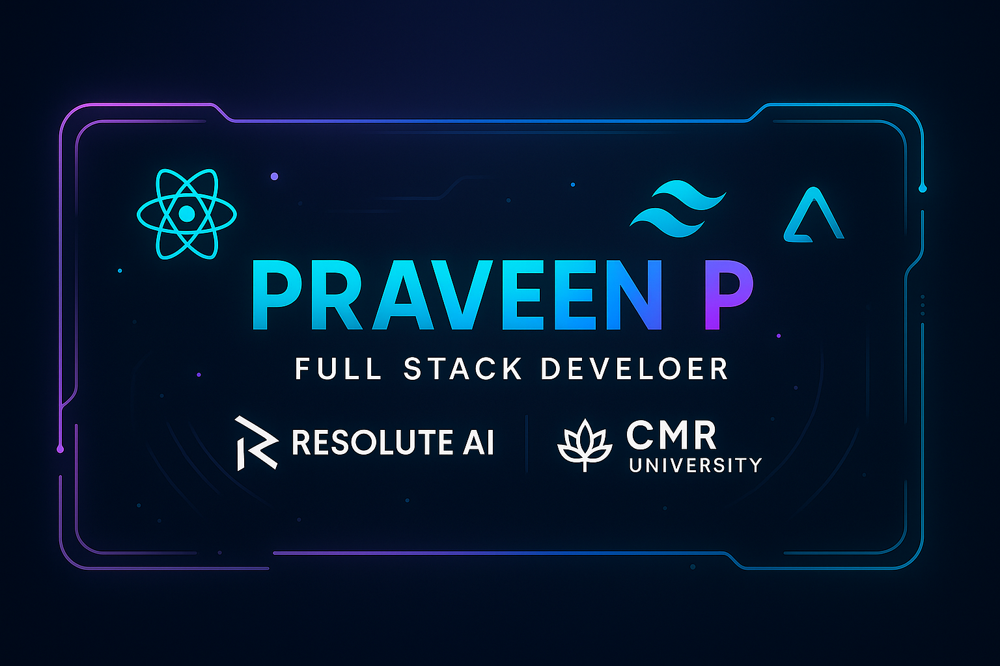

# 🚀 Praveen P – Backend Developer | Cloud Enthusiast

📍 **Location:** Bangalore, India  
🎓 **Education:** BCA Cloud Computing, CMR University  
💼 **Internship:** Backend Developer Intern at Resolute AI Software Pvt. Ltd.  
🌐 [Live Portfolio](https://praveen-p.vercel.app/) | [GitHub](https://github.com/Praveen-C05)

---

## 🧑‍💻 About Me

I’m **Praveen P**, a BCA Cloud Computing student at **CMR University**, focused on building scalable backend systems and cloud-integrated web applications.  
I work with technologies like **JavaScript**, **Node.js**, **Express**, **React**, **MongoDB**, and **AWS** to develop secure and efficient APIs and modern, cloud-ready solutions.

Currently, I’m interning as a **Backend Developer** at **Resolute AI**, contributing to health-tech platforms using **DynamoDB**, **AWS Lambda**, and **RESTful services**.

I hold certifications in **Cybersecurity**, **Web Development** from **IBM** and **Cloud Computing** from  **NPTEL (IIT Kharagpur)**.

---

## 🛠️ Tools & Technologies

**Languages**  
JavaScript · Java · PHP · C · SQL  

**Frameworks & Libraries**  
React.js · Express.js · Mongoose · Dynamoose  

**Databases**  
MongoDB · MySQL · DynamoDB  

**DevOps & Tools**  
Git · Bitbucket · GitHub · Appwrite · VS Code

---

## 📂 Projects & Contributions

🔴 **CmrVibeWaves** – A live broadcasting portal using HTML, CSS, JS, PHP, MySQL  
🚉 **Railway Reservation DB** – Designed normalized schema and optimized queries in MySQL  
🧠 **LUNA Project** – Backend module development in JavaScript + AWS for a health-tech web app  
🔗 **GitHub:** [github.com/Praveen-C05](https://github.com/Praveen-C05)

---

## 🎯 Professional Goals

As an aspiring **Full Stack Developer** and **Cloud Architect**, I aim to:

- Design scalable, secure, cloud-native applications
- Deepen my expertise in serverless architecture & microservices
- Contribute to open-source and impactful tech communities
- Stay updated with modern tools and frameworks

---

## 📫 Get In Touch

📧 Email: mr5praveen55@gmail.com  
🔗 LinkedIn: [linkedin.com/in/praveen-p](https://www.linkedin.com/in/mr5praveen/)
📁 Download CV: [Praveen-P_cv.pdf](./public/projects/PRAVEEN%20P_resume.pdf)

---

> Designed with ❤️ by Praveen P – 2025
